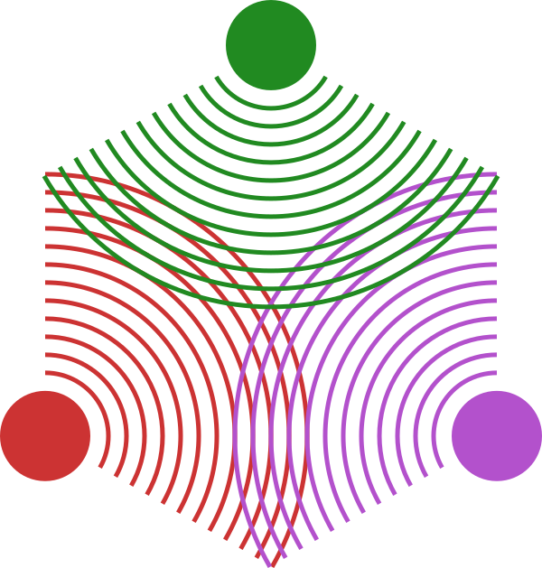

<a  href="docs/src/assets/RadonKA_logo.png"></a>

# WaveOpticsPropagation.jl

| **Build Status**                          | **Code Coverage**               | **Docs stable** | **Docs main** |
|:-----------------------------------------:|:-------------------------------:|:-----------------------:|:--------------------:|
| [![][CI-img]][CI-url] | [![][codecov-img]][codecov-url]                     | [](https://JuliaPhysics.github.io/WaveOpticsPropagation.jl/stable) | [](https://JuliaPhysics.github.io/WaveOpticsPropagation.jl/dev)


Propagate waves efficiently, optically, physically, differentiably with [Julia Lang](https://julialang.org/).
Those functions are fast and memory efficient implemented and hence are suited to be used in inverse problems.

⚠️ Under development. Expect things to break. But feel free to try the examples, they should always work!


## Installation
Officially registered, so install with:
```julia
julia> using Pkg; Pkg.add("WaveOpticsPropagation")
```

## Examples
Look into the [examples folder](examples/).

## Features
### Implemented
* Propagate (electrical) fields based on wave propagation
* Propagations
    * [x] Angular Spectrum Method of Plane Waves (AS)
    * [x] Fraunhofer Diffraction
    * [x] [Scalable Angular Spectrum propagation](https://opg.optica.org/optica/viewmedia.cfm?uri=optica-10-11-1407&html=true)
    * [x] Shifted Angular Spectrum propagation
    * [ ] Fresnel Propagation with Scaling Behaviour (no priority yet, PR are welcome for that. In principle very similar to the other methods.)
* [x] CUDA support
* [x] Differentiable (mainly based on Zygote.jl and ChainRulesCore.jl)

### Planned
Vectorial propagation in free space is just a propagation of each of the components. Right now, this is not a priority and is not implemented yet.
But of course, each vectorial component can be propagated separately.


## Citation
This package was created as part of scientific work. Please consider citing it :)
```bibtex
@article{Wechsler:24,
author = {Felix Wechsler and Carlo Gigli and Jorge Madrid-Wolff and Christophe Moser},
journal = {Opt. Express},
keywords = {3D printing; Computed tomography; Liquid crystal displays; Material properties; Ray tracing; Refractive index},
number = {8},
pages = {14705--14712},
publisher = {Optica Publishing Group},
title = {Wave optical model for tomographic volumetric additive manufacturing},
volume = {32},
month = {Apr},
year = {2024},
url = {https://opg.optica.org/oe/abstract.cfm?URI=oe-32-8-14705},
doi = {10.1364/OE.521322},
}
```

## Development
Contributions are very welcome!
File an [issue](https://github.com/JuliaPhysics/WaveOpticsPropagation.jl/issues) on [GitHub](https://github.com/JuliaPhysics/WaveOpticsPropagation.jl) if you encounter any problems.
Also file an issue if you want to discuss or propose features.


## Related packages
There is the outdated [PhysicalOptics.jl](https://github.com/JuliaPhysics/PhysicalOptics.jl) which provided similar methods.
For geometrical ray tracing use [OpticSim.jl](https://github.com/brianguenter/OpticSim.jl).

[CI-img]: https://github.com/JuliaPhysics/WaveOpticsPropagation.jl/actions/workflows/CI.yml/badge.svg
[CI-url]: https://github.com/JuliaPhysics/WaveOpticsPropagation.jl/actions/workflows/CI.yml

[codecov-img]: https://codecov.io/gh/JuliaPhysics/WaveOpticsPropagation.jl/branch/main/graph/badge.svg?token=6XWI1M1MPB
[codecov-url]: https://codecov.io/gh/JuliaPhysics/WaveOpticsPropagation.jl
